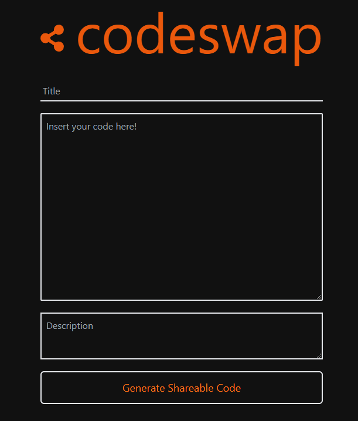
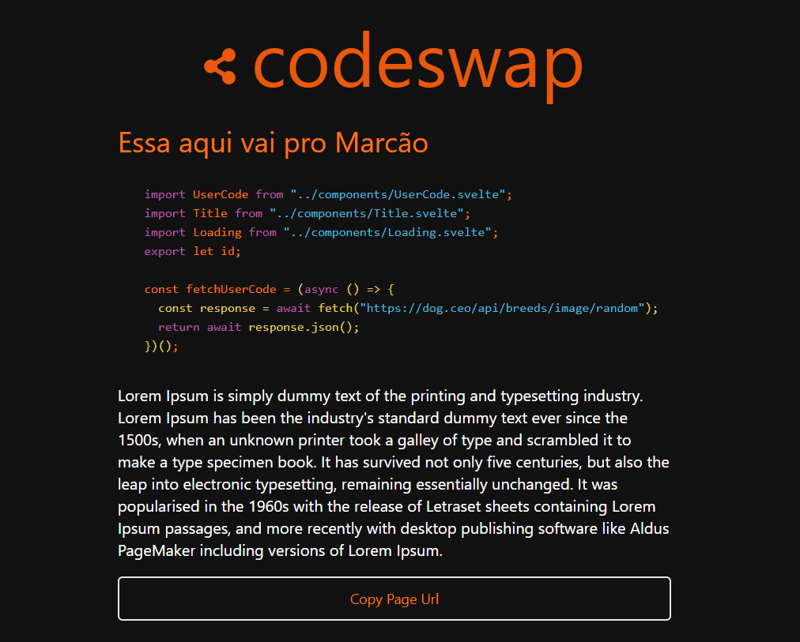
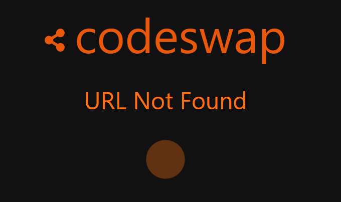

## codeswap
Check it live [here]()

A place for you to share code easily with others via the internet, using a title and a short description.

### Screenshots
<details open>
<summary>Screenshots</summary>




</details>

### Technologies Used:
<details>
<summary>Front-End</summary>

- [Svelte](https://svelte.dev/)
- [TailwindCSS](https://tailwindcss.com/)
- [HighlightJS](https://highlightjs.org/)
- [Tinro](https://github.com/AlexxNB/tinro)
- [Svelte-Icons](https://github.com/Introvertuous/svelte-icons)


This project was made with Svelte and TailwindCSS, you can also do something similar using:

#### Creating a TailwindCSS + Svelte project:

```yarn create vite```

```npx svelte-add@latest tailwindcss```
</details>


#### Created with love for the DEV + Appwrite [hackathon](https://dev.to/devteam/announcing-the-appwrite-hackathon-on-dev-1oc0)